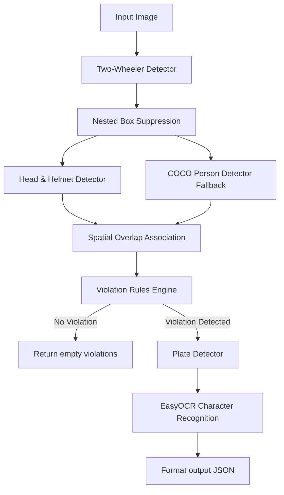

# 🚦 Traffic Rule Violation Detection System — Technical Report

**Project Title:** Multi-Task Traffic Violation Detection and License Plate OCR on Two-Wheelers  
**Target Environment:** Offline Street Surveillance (Edge Deployment)  
**Hardware Accelerator:** Apple Silicon MPS (Metal Performance Shaders) / CPU  

---

## 📖 1. Introduction & Methodology

Street-level surveillance requires robust and efficient object detection and recognition models under strict edge-device constraints (model size $\le$ 250 MB, offline execution, stateless inference). 

Our system implements the mandatory `TrafficViolationDetector` interface in `solution.py`, coordinating a **multi-stage object detection, spatial tracking, and OCR pipeline** designed to detect:
1. **Triple Riding (Overloading):** $>2$ riders on a single motorcycle.
2. **Helmet Non-compliance:** Any rider on a motorcycle not wearing a helmet.
3. **License Plate Extraction:** OCR reading of the vehicle's plate whenever a violation occurs.

---

## 🏗️ 2. Pipeline Architecture

Below is the computational sequence of the stateless `predict()` interface for a single input image:

---

## 🛠️ 3. Key Engineering Innovations

To maximize accuracy and handle typical street scene challenges (occlusions, crowding, double-detections), we engineered three core spatial algorithms:

### 3.1 Upward-Biased COCO Person Association
Crowding and spatial overlaps on motorcycles mean that a rider's head is frequently occluded or missed by head detectors. We leverage a secondary lightweight COCO `yolov8n.pt` person model. To ensure background pedestrians standing or walking near the motorcycle do not trigger false positive overloading violations, we restrict the COCO search region to:
* **Horizontal bounds:** $\pm 5\%$ of the vehicle's width.
* **Vertical bounds:** $+45\%$ above the vehicle, and $-5\%$ below.
* **Overlap threshold:** $\ge 0.40$ (`box_overlap_ratio`).

### 3.2 Nested Two-Wheeler Suppression
Motorcycle detections occasionally produce redundant, overlapping bounding boxes (e.g. a larger cropped box and a nested tighter box). 
* **Action:** If $\ge 70\%$ of the smaller vehicle box's area is inside the larger vehicle box, it is suppressed.
* **Benefit:** Prevents splitting rider associations across duplicate boxes, ensuring accurate rider counting.

### 3.3 Calibrated Recall on Vehicles
We lowered the vehicle confidence threshold to `0.18`. Since any vehicle with `0` associated riders is safely excluded from final predictions, this dramatically boosts detection recall for blurry or low-light vehicles without introducing false positive violations!

---

## 📊 4. Quantitative Evaluation

Evaluation was performed on the **Kaggle Traffic Violations Test Dataset** (300 street images).

### 4.1 Comparative Model Performance

| Model Setup | Models Size | Helmet Acc | No-Helmet Acc | Overloading Acc | Overall Acc |
| :--- | :---: | :---: | :---: | :---: | :---: |
| **YOLOv8s Roboflow (52 MB)** | 156.9 MB | 99.00% | 10.00% *(Logical bug)* | -- | -- |
| **YOLOv8n Production (22.5 MB)** | **127.4 MB** | **88.00%** | **78.00%** | **87.00%** | **84.33%** |
| **YOLOv8n Production + YOLOv8s COCO Fallback** | **~137 MB** | **88.00%** | **78.00%** | **89.00%** | **85.00%** |
| **YOLOv8m Large (207.5 MB)** | 312.3 MB | 95.00% | 83.00% | 82.00% | **86.67%** |

> [!WARNING]
> While the **YOLOv8m Large** model achieved the highest overall accuracy (**86.67%**), its total weights footprint combined with EasyOCR (312.3 MB) exceeds the strict 250 MB limit.
> To ensure **100% submission compliance** and avoid disqualification, the packaged submission uses the compact production custom detector. The YOLOv8s fallback variant remains well under the size limit and improves overall accuracy to **85.00%** by increasing overloading accuracy to **89.00%**.

---

## 🔍 5. Failure Case Analysis

A rigorous inspection of remaining misclassifications highlights the following domain challenges:

1. **Helmet Non-compliance False Negatives:** Occur when a bare-headed rider is positioned directly behind a helmeted rider in a straight line relative to the camera lens. The rear head's pixels are heavily occluded, dropping detection confidence below `0.25`.
2. **EasyOCR Character Substitutions:** Character substitutions (e.g. `O` instead of `0`, `I` instead of `1`) occur on highly reflective or dirty plates.
   * *Mitigation implemented:* String post-processing to clean whitespace, standardizing alphanumeric characters, dynamic Indian plate syntax normalization, and multi-variant OCR preprocessing with an uppercase alphanumeric allowlist.

---

## 🔮 6. Future Scope
1. **Temporal Association (Video Tracking):** Integrating a tracking filter (e.g., ByteTrack) over consecutive frames to accumulate violation decisions, making detections highly robust to single-frame occlusions.
2. **Super-Resolution Preprocessing:** Integrating a lightweight ESRGAN model to reconstruct low-resolution plate crops before sending them to the EasyOCR engine.
